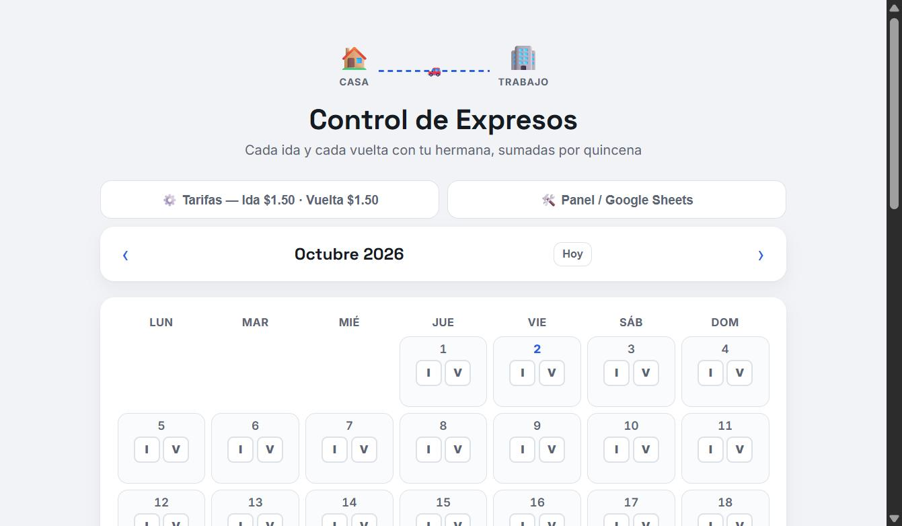

<div align="center">

# 🚐 Control de Expresos

**Registro de viajes de transporte expreso con totales por quincena y sincronización a Google Sheets**


<a href="https://luisfernando2607.github.io/control-expreso/"></a>



</div>

---

## 💡 ¿Para qué sirve?

Llevar el control diario de los viajes en expreso (ida y vuelta) sin cuadernos ni hojas sueltas, y saber al instante cuánto se debe pagar en cada quincena.

---

## ✨ Funcionalidades

- 📅 Registro de viajes de **ida y vuelta por día**
- 🧮 **Totales automáticos por quincena**
- ☁️ **Sincronización con Google Sheets** mediante Apps Script, con los datos respaldados en la nube
- 📱 Interfaz responsive pensada para usar desde el celular
- ⚡ Una sola página HTML, sin servidor ni instalación

---

## 🚀 Uso

1. Clona el repositorio:
   ```bash
   git clone https://github.com/luisfernando2607/control-expreso.git
   ```
2. Crea un proyecto de **Google Apps Script** vinculado a tu hoja de cálculo y publícalo como aplicación web.
3. Coloca la URL del Apps Script en `index.html`.
4. Abre `index.html` o publícalo en GitHub Pages.

---

<div align="center">

Desarrollado por **[Luis Fernando Flores](https://github.com/luisfernando2607)** · DevStar · Guayaquil, Ecuador 🇪🇨

</div>
